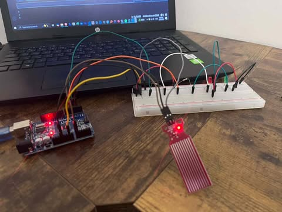

# WaterAlarm

This was one of my first ever arduino projects, so please excuse the rough  code. As I grow in this field I plan to add more features and make this cleaner and more professional - **hopefully**.

## Items required

- Arduino (duhhh)
- Water Sensor
- 1 Green LED (Connected via a 220R Resistor)
- 1 Red LED (Connected via a 220R Resistor)
- 1 Active buzzer
- Tons of cables

## Arduino Pin Mapping

- A0: S (Water Sensor)
- D2: Active Buzzer
- D3: Red LED
- D4: Green LED